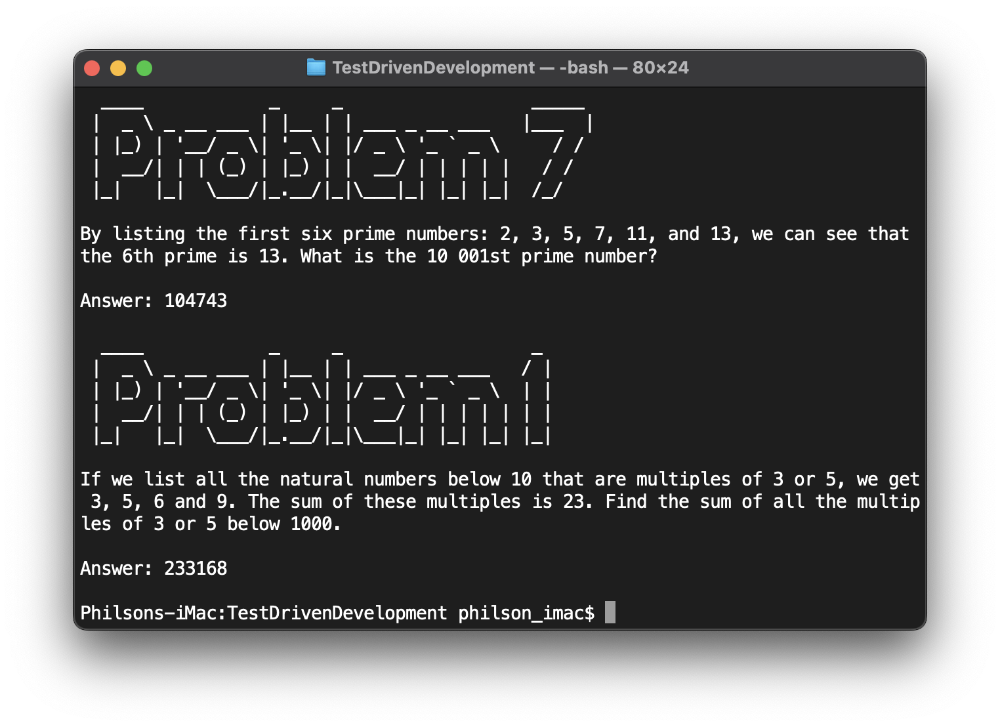
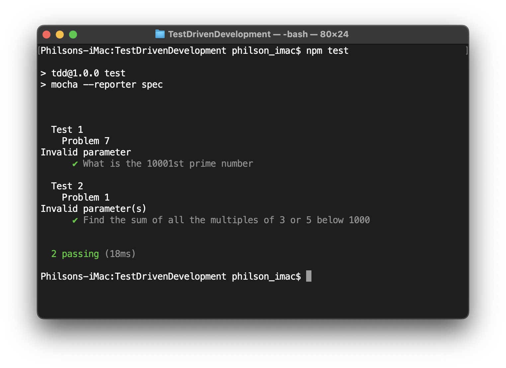

# Test Driven Development

The objective of this code challenge is to show capability to follow TDD practices to solve simple algorithmic code challenges to show proficiency in problem solving and code practices in the chosen language.


## Problem 7
By listing the first six prime numbers: 2, 3, 5, 7, 11, and 13, we can see that the 6th prime is 13.

What is the 10 001st prime number?

Source: https://projecteuler.net/problem=7

## Problem 1
If we list all the natural numbers below 10 that are multiples of 3 or 5, we get 3, 5, 6 and 9. The sum of these multiples is 23.

Find the sum of all the multiples of 3 or 5 below 1000.

Source: https://projecteuler.net/problem=1


# How to Run
```
npm install
npm test
node index.js
```

# Results


